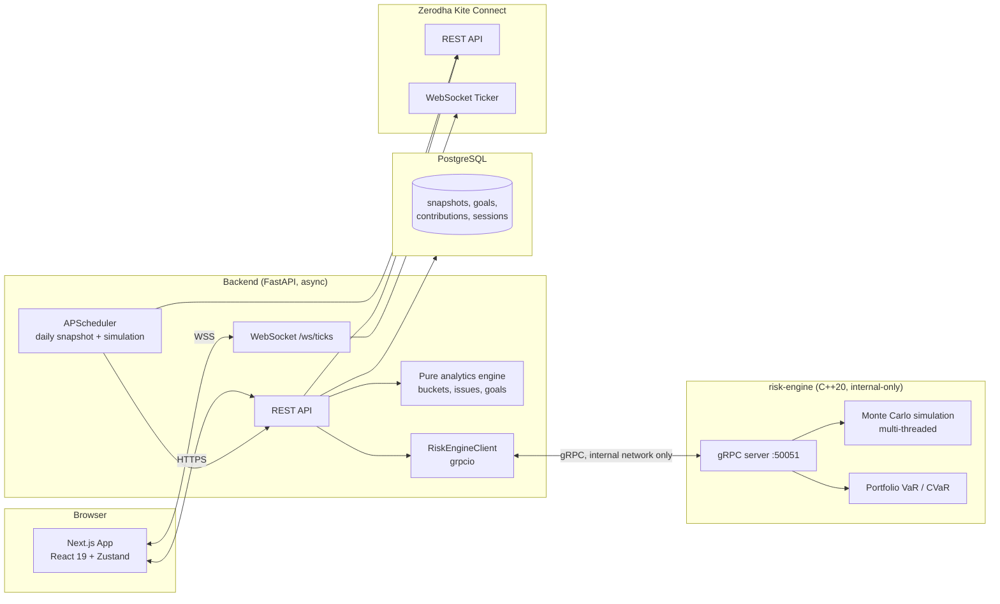

# WealthPilot

A personal portfolio audit and goal-tracking dashboard for a Zerodha account. This is a
resume-showcase project: it prioritizes clean architecture, tests, and deployability over raw
feature count.

**Read-only by default.** WealthPilot reads holdings, positions, margins and market data from
Zerodha's Kite Connect API. The one exception is a human-in-the-loop GTT sell for the legacy exit
plan: it dry-runs by default and places an order only on an explicit confirm. The public demo
(`DEMO_MODE`) refuses every write, orders included.

The portfolio, goals and amounts in the repo are a **fictional investor** — the demo and the tests
run on them.

> Informational only — not licensed financial advice. Simulation outputs are estimates based on
> user-specified assumptions, not predictions.

## Why this project exists

Most portfolio dashboards are CRUD apps with a chart bolted on. WealthPilot is deliberately built
around five things that don't show up in a typical CRUD project:

1. **Third-party API integration with a real credential lifecycle** — Kite Connect access tokens
   expire daily; the app detects, surfaces, and recovers from that gracefully instead of just
   erroring out.
2. **Scheduled background jobs** — a daily snapshot + simulation run, independent of any request.
3. **A pure, heavily-tested domain/analytics engine** — bucket classification, risk-rule
   detection, and goal glide-paths as framework-free Python functions with ≥90% coverage.
4. **Live market-data streaming end-to-end** — Kite's WebSocket ticker → FastAPI re-broadcast →
   browser, with reconnect/backpressure handling.
5. **A polyglot architecture** — the one genuinely CPU-bound workload (Monte Carlo goal
   simulation) is isolated behind a gRPC boundary in a C++ service, not bolted into the Python
   request path.

## Stack

| Layer | Technology |
|---|---|
| Frontend | Next.js 15 (App Router), React 19, TypeScript, Tailwind CSS, shadcn/ui, Zustand, Chart.js |
| Backend | Python 3.12, FastAPI (async), SQLAlchemy 2.0 async + Alembic, PostgreSQL, APScheduler, `pykiteconnect`, Pydantic v2, `grpcio` |
| Risk Engine | C++20, CMake, gRPC + Protocol Buffers, GoogleTest |
| Infra | Docker + docker-compose, Caddy (TLS + same-origin reverse proxy), GitHub Actions CI |

## Architecture



The risk-engine has no published host port and is reachable only from the backend over the
private service network.

## Monorepo layout

```
frontend/       Next.js 15 app (App Router)
backend/        FastAPI service, analytics engine, Alembic migrations
risk-engine/    C++20 gRPC microservice (Monte Carlo simulation, portfolio risk)
docker-compose.yml
.github/workflows/ci.yml
```

## Local development

### Prerequisites

- Node.js 22+, npm
- Python 3.12
- CMake, Protobuf compiler, gRPC (C++), GoogleTest — `brew install cmake protobuf grpc googletest clang-format` on macOS
- Docker + Docker Compose (for the full stack)

### Frontend

```bash
cd frontend
npm install
npm run dev        # http://localhost:3000
npm run lint
npm run typecheck
npm run test
```

### Backend

```bash
cd backend
python3.12 -m venv .venv && source .venv/bin/activate
pip install -e ".[dev]"
uvicorn app.main:app --reload   # http://localhost:8000/healthz
ruff check .
mypy app
pytest --cov=app
```

### Risk engine

```bash
cd risk-engine
cmake -S . -B build -DCMAKE_BUILD_TYPE=Release
cmake --build build -j"$(nproc)"
ctest --test-dir build --output-on-failure
```

### Full stack (Docker Compose)

```bash
docker compose up --build
```

Brings up Postgres, the backend (`:8000`), the frontend (`:3001` on the host — mapped from the
container's `:3000` to avoid clashing with other local dev servers), and the risk-engine
(internal-only, `risk-engine:50051`, no host port published).

### Public demo (read-only)

```bash
docker compose -f docker-compose.yml -f docker-compose.demo.yml up -d --build
```

`DEMO_MODE=true` forces mock Kite and mock market data and drops every key (Anthropic, Ollama,
push, app password) even if the environment sets them, so a stray real value can't reach the
public. Every write is refused with `403 read_only_demo` except the calculation endpoints
(`/api/goals/{id}/simulate|stress|required-contribution`, `/api/goals/optimize`), which always run
the server's path count. The frontend shows a "Demo · fictional portfolio" banner.

## Environment variables

**Backend** (`backend/.env`, see `backend/.env.example`):

| Variable | Description | Default |
|---|---|---|
| `KITE_API_KEY` | Zerodha Kite Connect API key | `mock-api-key` |
| `KITE_API_SECRET` | Zerodha Kite Connect API secret | `mock-api-secret` |
| `KITE_REDIRECT_URL` | Redirect URL registered on the Kite app | `http://localhost:3001/auth/kite/callback` |
| `USE_MOCK_KITE` | Use `MockKiteService`/`MockTickerService` instead of live Kite | `true` |
| `FERNET_KEY` | Symmetric key encrypting the Kite access token at rest (required only in live mode) | — |
| `DATABASE_URL` | Async PostgreSQL connection string | local Postgres |
| `RISK_ENGINE_HOST` | Hostname of the risk-engine gRPC service | `localhost` |
| `RISK_ENGINE_PORT` | Port of the risk-engine gRPC service | `50051` |
| `SIMULATION_PATHS` | Default Monte Carlo paths per goal simulation | `10000` |
| `USE_MOCK_RISK_ENGINE` | Use the in-process approximation instead of the C++ gRPC engine | `true` |
| `FRONTEND_ORIGIN` | Allowed CORS origin | `http://localhost:3001` |
| `ENABLE_SCHEDULER` | Run the weekday 09:45 IST auto-snapshot job | `true` |
| `AUTO_CREATE_TABLES` | Create tables on startup (dev only; Alembic owns schema in containers) | `true` |
| `DEMO_MODE` | Public read-only demo: mock data only, no keys, writes refused | `false` |

**Frontend** (`frontend/.env.local`, see `frontend/.env.example`):

| Variable | Description | Default |
|---|---|---|
| `NEXT_PUBLIC_API_BASE_URL` | Backend base URL (REST + WebSocket derived from it) | `http://localhost:8000` |
| `NEXT_PUBLIC_DEMO_MODE` | Show the demo banner (build-time) | `false` |

Generate a Fernet key with:

```bash
python -c "from cryptography.fernet import Fernet; print(Fernet.generate_key().decode())"
```

## Features

Seven tabs, all driven by the mock portfolio out of the box (`USE_MOCK_KITE=true`):

- **Overview** — live KPI cards (total / P&L / per-bucket / cash), an allocation bar chart
  (current weights vs a ⅓ target for the growth/dividend/MF split), and holdings + mutual-fund
  tables whose LTP/P&L cells update live with a flash animation.
- **Market** — curated index/sector cards, color-coded by day change, with live sparklines.
- **Trends** — total-value and bucket-%-over-time line charts from the snapshot history.
- **Goals** — timeline progress, months-to-target, an editable monthly-contribution field, and a
  **Simulate** panel showing the risk engine's probability-of-success plus a p10–p90 ending-value
  band with a Recalculate button.
- **Issues** — severity-colored, live-computed flags (concentration, drawdown, duplicate ELSS, …).
- **MF Audit** — keep-vs-swap table with approximate (editable) expense ratios and alternatives.
- **Action Plan** — a prioritized list derived from the active issues.

A status badge shows **LIVE / DELAYED / SNAPSHOT**; a "Reconnect Zerodha" banner appears if the
daily token expires.

### API surface (backend)

`/api/auth/kite/{login,callback,status}` · `/api/snapshots/{refresh,latest,history}` ·
`/api/analytics/{issues,action-plan,mf-audit,goals}` · `/api/goals` (CRUD) +
`/api/goals/{id}/simulate` · `/api/contributions`, `/api/bucket-overrides`, `/api/settings` (CRUD) ·
`/api/market/overview` · `ws://…/ws/ticks`.

## Testing

| Component | Command | Covers |
|---|---|---|
| Backend | `pytest --cov=app` | 180 tests — the analytics engine at 99% line coverage, API integration against the mock, token expiry, simulation cache, demo-mode guard |
| Backend | `ruff check . && mypy app` | Lint + strict typing |
| Frontend | `npm run test` | Vitest units (formatting, ticker store) |
| Frontend | `npm run test:e2e` | Playwright smoke test (dashboard renders with mocked API, incl. Market + Goals panels) |
| Frontend | `npm run typecheck && npm run lint` | `tsc --noEmit` + ESLint |
| Risk engine | `ctest --test-dir build` | 34 GoogleTests — zero-vol determinism, seed reproducibility, CVaR decomposition, edge cases |

Everything runs offline against mock services and fixture data — no Zerodha credentials or the C++
binary required for development or CI.

## Deployment

One box, one compose stack: `docker-compose.prod.yml` adds Caddy, which terminates TLS (automatic
Let's Encrypt) and proxies same-origin to the frontend and backend; only 80/443 are published. The
backend runs `alembic upgrade head` on start. See [`docs/DEPLOYMENT.md`](docs/DEPLOYMENT.md), and
the demo section above for the public read-only instance.

Optional Kubernetes manifests live in [`k8s/`](k8s/) as a stretch artifact.

## Security

- Kite access token stored **Fernet-encrypted at rest**; never logged or returned in plaintext.
- Orders only through the GTT sell flow: dry-run by default, placed only on an explicit confirm.
  `DEMO_MODE` refuses it along with every other write.
- CORS locked to `FRONTEND_ORIGIN`; the risk-engine gRPC port is never exposed outside the private
  network.
- No secrets in code — everything is env-driven, with `.env.example` templates provided.

## Screenshots

_Add captures of the Overview, Goals (Simulate panel), and Market tabs here._

| Overview | Goals — Simulate | Market |
|---|---|---|
| _`docs/overview.png`_ | _`docs/goals.png`_ | _`docs/market.png`_ |
