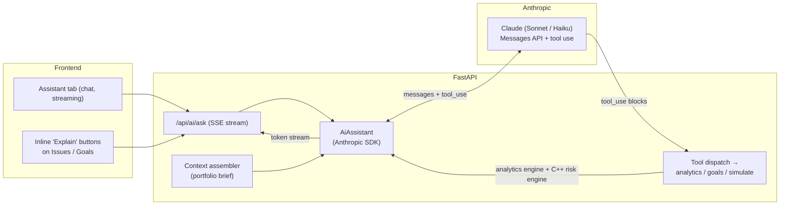

# Phase 8 — AI Layer (design sketch)

> Status: **design only** — not yet implemented. This document is the plan.

A Claude-powered assistant layered on top of the existing analytics engine. The
key insight: WealthPilot already produces **rich, structured, framework-free
analysis** (bucket classification, issue rules with ₹ figures, goal glide-paths,
Monte Carlo simulations). That is exactly the grounded context an LLM needs to
be useful and non-hallucinatory. The AI layer *narrates, reasons over, and runs
what-ifs against* that engine — it does not invent numbers.

Read-only by design, like the rest of the app. The assistant can *analyze and
suggest*; it can never place an order (no such capability exists).

---

## 1. Features (prioritized)

| # | Feature | Backed by |
|---|---|---|
| 1 | **Explain my portfolio** — plain-English narration of the current snapshot, allocation vs the ⅓ target, and top issues | latest snapshot + `detect_issues` + `bucket_totals` |
| 2 | **Action plan, reasoned** — turn the rule-based action plan into a prioritized, *why-it-matters* narrative | `/api/analytics/action-plan` |
| 3 | **Ask anything** — "How am I tracking for the Travel Fund?", "Why is dividend flagged?", "What's my most concentrated position?" | tool-use over analytics/goals/snapshot |
| 4 | **Goal coaching / what-ifs** — "What if I add ₹5k/month?" → Claude calls the simulate endpoint with new inputs and compares | `POST /api/goals/{id}/simulate` → C++ risk engine |
| 5 | **MF audit narration** — explain KEEP/RETIRE calls and the cost of the duplicate ELSS in rupees | `/api/analytics/mf-audit` |
| 6 | **Weekly digest** — scheduled summary of what changed since last week (value, new issues, goal drift) | APScheduler + snapshot history |

---

## 2. Architecture

**New module `app/ai/`:**
- `context.py` — `build_portfolio_brief(db) -> str`: a compact markdown brief from
  the latest snapshot + issues + goal analyses + MF audit + market overview. This
  is the stable grounding block (changes only when a snapshot is taken → a prime
  **prompt-caching** target).
- `assistant.py` — `AiAssistant` wrapping `anthropic.AsyncAnthropic`; owns the
  system prompt, model routing, streaming, and the tool-use loop.
- `tools.py` — tool schemas + dispatch mapping Claude tool calls to internal
  functions (see §3).
- `mock.py` — `MockAiAssistant` returning canned/deterministic responses so tests
  and CI never call the API (mirrors `MockKiteService` / `MockRiskEngineClient`).
- `factory.py` — select real vs mock by `USE_MOCK_AI`.

**Endpoints:**
- `POST /api/ai/ask` — `{ question, thread_id? }` → **SSE** token stream.
- `GET /api/ai/explain` — one-shot portfolio narration (cached per snapshot, like
  `goal_simulation` — regenerate only when the snapshot id changes).

**Frontend:** an **Assistant** tab (chat UI consuming the SSE stream via
`EventSource`), plus inline "Explain" buttons on the Issues and Goals tabs that
call `/api/ai/ask` with a templated question.

---

## 3. Tool use (the agentic part)

Claude is given tools that map to internal functions, so it can *fetch exactly
what it needs* and *run simulations*, rather than being force-fed everything:

| Tool | Maps to | Notes |
|---|---|---|
| `get_issues` | `detect_issues(latest snapshot)` | severity-ranked flags |
| `get_goal_analysis` | `analyze_goals(...)` | timeline, assigned value, violations |
| `get_mf_audit` | `audit_mf(...)` | KEEP/RETIRE + costs |
| `simulate_goal` | `simulate_goal_and_cache(...)` → **C++ risk engine** | args: `goal_id, monthly_contribution?, target_value?` — powers "what-if" |
| `get_holdings` | latest snapshot holdings | filter/sort by value, P&L, bucket |

The assistant runs the standard tool-use loop: send message + tools → receive
`tool_use` blocks → execute → return `tool_result` → repeat until a final answer.
"What if I add ₹5k/month to the Travel Fund?" becomes: Claude calls
`simulate_goal(travel, monthly_contribution=17000)`, gets a fresh probability from
the real Monte Carlo engine, and compares it to the current one.

---

## 4. Model, SDK, cost

- **SDK:** Anthropic Python SDK — `anthropic.AsyncAnthropic`, Messages API with
  `tools` and streaming.
- **Model routing:** Haiku for cheap/simple (weekly digest, classification),
  Sonnet for the main assistant + tool-use reasoning, Opus reserved for deep
  one-off analysis. Configurable via `AI_MODEL`.
- **Prompt caching** on the portfolio-brief system block (stable between
  snapshots) → large cost savings on multi-turn chats.
- **Response caching** for `/api/ai/explain` keyed by snapshot id (same pattern
  as the `goal_simulation` cache).
- **Streaming** for perceived latency.

---

## 5. Safety & guardrails

- **Read-only**: tools never mutate positions; there is no order path.
- **Grounded**: system prompt instructs Claude to answer *only* from the provided
  brief + tool results, and to say "I don't have that data" otherwise — minimizes
  hallucinated numbers.
- **No secrets in prompts**: the Kite token and raw credentials are never sent —
  only derived analytics (values, %s, flags).
- **Disclaimer** appended to every response: *informational only, not licensed
  financial advice, simulations are estimates* — same footer the UI already shows.
- **Budget caps + rate limiting** per session; `USE_MOCK_AI=true` keeps CI/offline
  free and deterministic.

---

## 6. Phasing

- **8A — Narration (read-only).** Context assembler, `AiAssistant`,
  `POST /api/ai/ask` + `GET /api/ai/explain` (context stuffed, no tools yet),
  Assistant tab + inline Explain buttons. Ship the "explain my portfolio" and
  "reasoned action plan" features.
- **8B — Agentic tool-use.** Add the tool schemas + dispatch; enable Q&A and goal
  what-ifs that call the analytics and C++ risk engine.
- **8C — Proactive.** Scheduled weekly AI digest via APScheduler (stored, shown on
  load), plus snapshot-over-snapshot anomaly callouts.

---

## 7. Testing

- `MockAiAssistant` → deterministic canned responses; no API calls in CI.
- Unit-test `build_portfolio_brief` (pure) against fixture snapshots.
- Test tool dispatch: each tool name routes to the right function and shapes args.
- Endpoint tests with the mock assistant (SSE framing, disclaimer present).
- Optional eval harness: a small set of graded prompts to catch prompt
  regressions (golden Q→A quality checks).

---

## 8. Config (new)

| Var | Default | Purpose |
|---|---|---|
| `USE_MOCK_AI` | `true` | Deterministic mock assistant for dev/CI |
| `ANTHROPIC_API_KEY` | — | Required only when `USE_MOCK_AI=false` |
| `AI_MODEL` | Sonnet | Default model for the assistant |
| `AI_MAX_TOKENS` | `1024` | Response cap |

---

## 9. Open questions

- **Conversation persistence** — store threads in Postgres (a `chat_message`
  table) or keep chats ephemeral/client-side?
- **Multi-user** — the app is currently single-user; an AI assistant with
  per-user context would need the auth/session model to grow first.
- **Guardrail tuning** — how firmly to steer the model away from prescriptive
  "buy/sell X" advice while still being useful.
